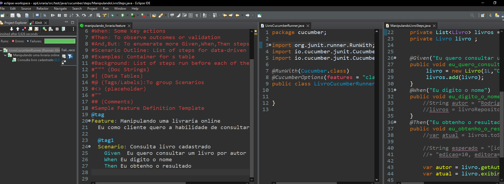

# Kratos

| Step    | Objetivo                                                                               | Check    |
| ------- | -------------------------------------------------------------------------------------   | --------|
|    1    | A IDE usada deverá ser o Eclipse.                                                       |   ✔    |
|    2    | Versionamento GitHub                                                                    |   ✔    |
|    3    | Automatizar com Cucumber [Pesquisa Integrando Cucumber com SpringBoot](https://www.baeldung.com/cucumber-spring-integration)                                                                |   ✔ ❌   |
|    4    | Automatizar com Jmeter                                                                  |    ✔   | 
|    5    | Automatizar com Appium  [Projeto repositório GitHub](https://github.com/GraceTorresLeite/Kratos_Appium_Tests)                                                                 |   ✔   |                   
|    6    | Automatizar com Selenium                                                                |     ✔  | 
|    7    | Utilização de ferramentas (Metodologia Ágeis)                                           |   ✔    | 
|    8    | O cliente deve possuir:  Nome, E-mail, Telefone, CPF, RG e Endereço                     |   ✔    |
|    9    | O projeto deve conter sistema de  cadastramento                                         |     ✔  |

### Interface 

## ERR - Diagrama Workbench

* TERMINAL ECLIPSE 

## Evidência - Cucumber 

[Site mvnrepository](https://mvnrepository.com/artifact/io.cucumber)

## Evidência - Appium 

* TERMINAL E EMULADOR INTELLIJ

## Evidência - Coverage

## Evidência - Run application

## Evidência - Testes de integração e unitário

## Evidência - Postman

